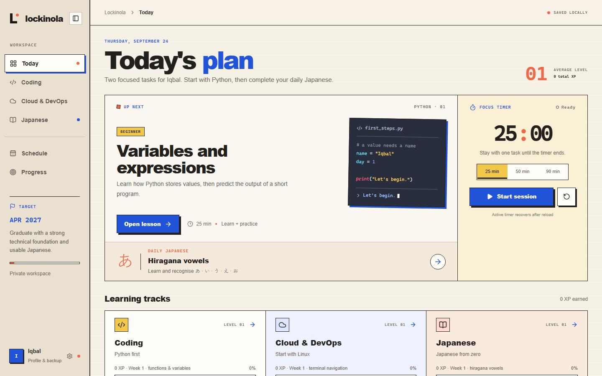

# Lockinola



Lockinola is my private study tracker for coding, cloud and DevOps, and Japanese. It keeps lessons, focus sessions, lab notes, code checks, reviews, XP, and schedules in one place.

## Stack

- React, TypeScript, Vinext, and Vite
- Cloudflare Workers and D1
- Ollama for lesson reviews
- GitHub Actions for deployment

## Local development

Requires Node.js 22.13+, Python 3, and Ollama.

```bash
npm install
ollama pull qwen3.8:27b
copy .env.example .env.local
npm run dev
```

The app normally runs at `http://localhost:5173`. The local Python checker listens only on `127.0.0.1:4317`.

## Checks

```bash
npm run typecheck
npm run build
```

## Deployment

The hosted app uses a password-protected Cloudflare Worker and D1 for progress sync. Deployment instructions and required secrets are in [DEPLOYMENT.md](DEPLOYMENT.md).

Production: [lockinola.skirnola.workers.dev](https://lockinola.skirnola.workers.dev)
